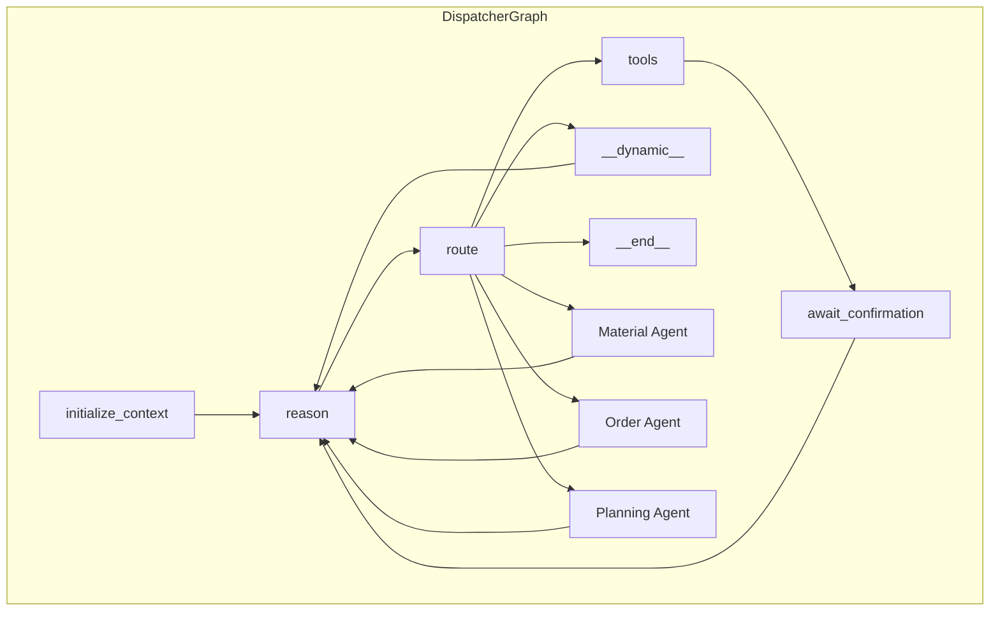

# Dispatcher Graph

```mermaid
flowchart TD
    subgraph DispatcherGraph
      init["initialize_context"] --> reason["reason"]
      reason --> route["route"]
      route --> tools["tools"]
      tools --> await["await_confirmation"]
      await --> reason
      route --> dynamic["__dynamic__"]
      dynamic --> reason
      route --> end_node["__end__"]
      %% edges to subagents (e.g., Material Agent, Order Agent, Planning Agent)
      route --> Material["Material Agent"]
      route --> Order["Order Agent"]
      route --> Planning["Planning Agent"]
      Material --> reason
      Order --> reason
      Planning --> reason
    end
```
